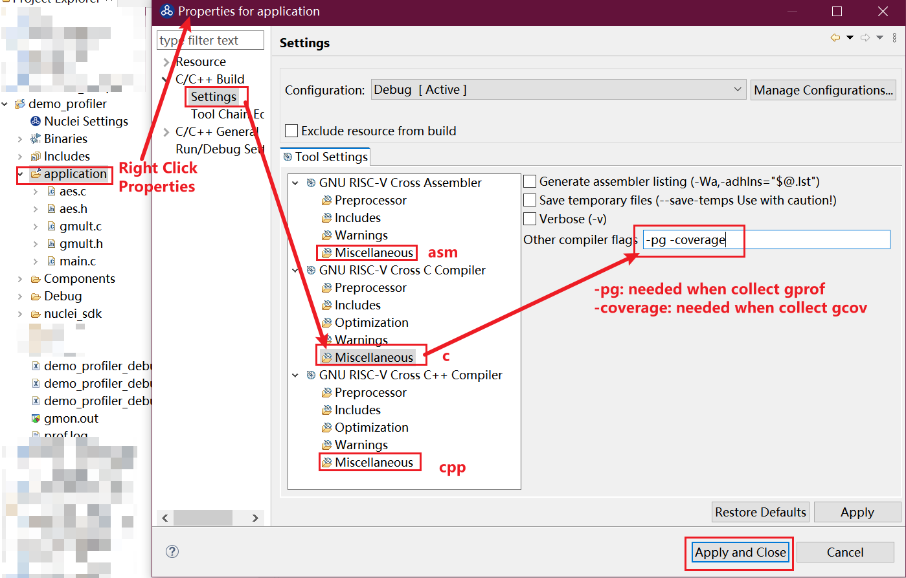

# Profiling For RISC-V

Profiling technology such as gprof and gcov is useful to help improve find bottom-neck of source
code and not covered code.

- gprof: https://sourceware.org/binutils/docs/gprof/index.html
- gcov: https://gcc.gnu.org/onlinedocs/gcc/gcov/introduction-to-gcov.html

In this directory, we provide utils source code to do profiling and coverage using gcov and gprof
technology.

## Profiling util files

- `gcov.c` & `gcov_api.h`: Collect coverage data after program executed
   - You should add extra `-coverage` compiler option
   to the source files you want to collect coverage information.
- `gprof.c`, `gprof_api.h` & `gprof_stub.c`: Collect profiling data after program executed
   - You should add extra `-pg` compiler option to the source files you want to collect profiling information.
   - `gprof_stub.c` contains some stub functions required to setup a period interrupt to do program sampling required by gprof,
   you need to customize it by yourself. For details, please check the `gprof_stub.c` file by yourself.
   - The sampling period is controlled by `PROF_HZ`(1000 means 1ms, 10000 means 100us) defined in `gprof_api.h`
   - and you should also set correct `PROGRAM_LOWPC` and `PROGRAM_HIGHPC`
   defined in `gprof_api.h`

- `parse.py`: a script use to parse gcov and gprof dump log file, and generate gcov or gprof binary files.

## How to use

Add this `profiling` folder into your project, and do steps below:

- Modify `gprof_stub.c` and `gprof_api.h` if you want to collect profiling information,
  and add extra `-pg` compiler option to the source files you want to profile.

- Add extra `-coverage` option to the source files you want to coverage.

- Call `gprof_collect(interface)` after the key program you want to profile

- Call `gcov_collect(interface)` after the key program you want to coverage

- `interface` can be `0`, `1`, `2`

  - `0`: collect gprof or gcov data in buffer, you can use gdb script to dump gcov or gprof binary files when you are debug the program.
  - `1`: require semihosting or file open/close is supported! It will directly write the gprof or gcov data into files.
  - `2`: dump gcov or gprof data directly in console, and you can copy all the log and save it in a file, such as `prof.log`, and then
    you can use the `parse.py` script to analyze the log file and dump it as binary into your project folder, such as `python3 /path/to/parse.py prof.log`

In Nuclei Studio, for `interface == 2`, you can directly choose the console window, and select all the log, and right click `Parse and generate HexDump`,
for `interface == 0`, in debug mode, you can select a thread, and right click on it, and you can click `Dump Gcov` or `Dump Gprof` to generate binary files.

Adding extra compiler options can be done in Nuclei Studio via steps below:

In Nuclei Studio, you can click the source file or source folder you want to add extra options,
and right click `Properities`, and add flags in `C/C++ Build -> Settings -> GNU RISC-V Cross Assembler/C Compiler/C++ Compiler -> Miscellaneous -> Other xxx flags`,
and then click `Apply and Close`, and then rebuild this program.

