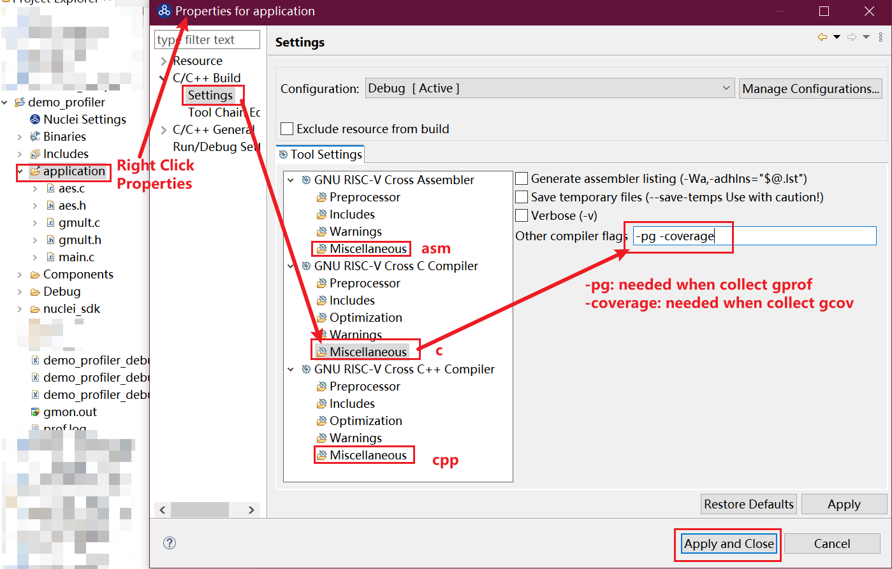

# Profiling and Coverage For Nuclei RISC-V CPU In Nuclei Studio IDE

> [!NOTE]
> The profiling middleware uses `%02` format specifier in its printf statements. Ensure your C library supports this format.

Profiling and coverage analysis tools like gprof and gcov play a vital role in identifying performance bottlenecks
and untested regions within source code, ultimately leading to improved software efficiency and quality.

## Gprof (GNU Profiler)

Gprof (GNU Profiler) instruments the compiled binary, adding code to track the entry and exit of each function and record timestamps.
This enables it to measure the exact execution time of each function, distinguishing between self-time (time spent within the function itself) and inclusive time (time spent in the function and its callees).
Additionally, Gprof constructs a call graph based on function call frequencies, visualizing the hierarchical structure of function interactions.

Gprof is primarily used for performance analysis and optimization. By providing detailed timing data and a call graph, it helps developers:

- Locate performance bottlenecks: Identifying functions that consume excessive time or have inefficient implementations.
- Understand program flow: Revealing the relationships between functions and their call frequencies within the program.
- Guide optimization efforts: Offering precise timing information to target specific functions or call patterns for improvement.

> [!NOTE]
> Gprof requires a period interrupt to do program sampling. You must customize the `gprof_stub.c` file to set up the timer interrupt for your specific hardware.

## Gcov (GNU Coverage Analyzer)

Gcov instruments the compiled code to monitor which lines and branches are executed during testing. It records the number of times each line is executed and tracks the coverage of conditional branches, ensuring comprehensive coverage assessment.

Gcov serves as a code coverage analysis tool, primarily used for evaluating test suite thoroughness and enhancing software quality. It helps developers:

- Measure test coverage: Quantifying the percentage of code exercised during testing, including line and branch coverage.
- Identify untested or under-tested code: Generating annotated source code files that highlight covered and uncovered lines and branches, enabling targeted improvement of the test suite.
- Promote comprehensive testing: Encouraging thorough testing practices and the development of a robust test suite by pinpointing areas needing additional coverage.

## Toolchain Support and Compatibility

This profiling component now supports both **GCC** and **LLVM/Clang** toolchains for gprof and gcov functionality:

| Toolchain | gprof Support | gcov Support | gcov Data Format |
|-----------|---------------|--------------|------------------|
| GCC (`riscv64-unknown-elf-gcc`) | ✓ | ✓ | GCC gcov format |
| LLVM/Clang (`riscv64-unknown-elf-clang`) | ✓ | ✓ | LLVM gcov format |

> [!IMPORTANT]
> **GCC and LLVM/Clang generate incompatible gcov data formats.** You must use the corresponding tool to parse the coverage data:
>   - For GCC-compiled code: use `riscv64-unknown-elf-gcov` to parse coverage information
>   - For LLVM/Clang-compiled code: use `llvm-cov gcov` to parse coverage information
>
> **Nuclei Studio IDE Coverage Support:**
>   - The IDE currently supports GCC gcov format coverage data visualization
>   - **LLVM/Clang gcov format is NOT yet supported in Nuclei Studio IDE**
>   - For LLVM/Clang coverage analysis, you must use the command-line tool:
>     ```bash
>     llvm-cov gcov <your-compiled-file>.gcda
>     ```
>   - GCC coverage data can still be viewed directly in the IDE's Coverage view

In this directory, we provide utils source code to do profiling and coverage using gcov and gprof
technology.

For more details about gprof and gcov, refer to the following links:

- gprof: https://sourceware.org/binutils/docs/gprof/index.html
- gcov: https://gcc.gnu.org/onlinedocs/gcc/gcov/introduction-to-gcov.html
- llvm coverage: https://clang.llvm.org/docs/SourceBasedCodeCoverage.html

## Profiling util files

- `gcov.c` & `gcov_api.h`: Collect coverage data after program executed
   - You should add extra `-coverage` compiler option to the source files you want to collect coverage information.
   - **Note:** Both GCC and LLVM/Clang support `-coverage` option, but they generate different gcov data formats
- `gprof.c`, `gprof_api.h` & `gprof_stub.c`: Collect profiling data after program executed
   - You should add extra `-pg` compiler option to the source files you want to collect profiling information.
   - **Modify** `gprof_stub.c` contains some stub functions required to setup a period interrupt to do program sampling required by gprof,
     you **must customize it by yourself**. For details, please read the `gprof_stub.c` file **carefully** by yourself.
   - The sampling period is controlled by `PROF_HZ`(1000 means 1ms, 10000 means 100us) defined in `gprof_api.h`
   - and you should also set correct `PROGRAM_LOWPC` and `PROGRAM_HIGHPC` defined in `gprof_api.h`

- `parse.py`: a python script use to parse gcov and gprof dump log file, and generate gcov or gprof binary files.
  To run this script, need python3 installed in your host pc.

- `dump_gcov.gdb`: gdb script to dump coverage data when you execute `gcov_collect(0);` in your application code.

- `dump_gprof.gdb`: gdb script to dump profiling data when you execute `gprof_collect(0);` in your application code.

You can execute above gdb script in Debug Console like this `source /path/to/dump_gcov.gdb`.

## Example Application

For a complete working example of how to use this profiling component, refer to the [demo_profiling](https://doc.nucleisys.com/nuclei_sdk/design/app.html#demo-profiling) application in Nuclei SDK.

The ``demo_profiling`` example demonstrates:

- How to integrate the profiling component into your project
- How to configure compiler flags (`-coverage` for gcov, `-pg` for gprof)
- How to call `gcov_collect(x)` and `gprof_collect(x)` functions
- How to dump and analyze coverage and profiling data

You can find the example at ``application/baremetal/demo_profiling`` in the Nuclei SDK.

## How to Use

### Step 1: Add Profiling Component to Your Project

Add this `profiling` folder into your project or create project based on ``demo_profiling`` example, then configure your build system:

#### For Nuclei Studio IDE

1. Right-click on the source file or folder you want to profile/coverage
2. Select **Properties** → **C/C++ Build** → **Settings**
3. Navigate to **GNU RISC-V Cross Assembler/C Compiler/C++ Compiler** → **Miscellaneous** → **Other xxx flags**
4. Add the following flags:
   - `-pg` for profiling
   - `-coverage` for coverage analysis
5. Click **Apply and Close**, then rebuild your project



#### For Nuclei SDK Makefile-based Build System

Edit your ``Makefile`` to configure profiling and coverage support:

```makefile
# Enable profiling middleware
MIDDLEWARE := profiling

# Source and include directories
SRCDIRS = . src
INCDIRS = . inc

# Specify directories that need profiling/coverage compilation flags
# If left empty, APP_COMMON_FLAGS will be applied to all source files
APPDIRS := . src

# Application-specific compilation flags
# -pg enables profiling instrumentation
# -coverage enables coverage analysis (requires more memory)
APP_COMMON_FLAGS := -pg -coverage

# Memory configuration - profiling/coverage require significant memory
# Use 'sram' or 'ddr' download mode
DOWNLOAD ?= sram

# Disable optimization for accurate profiling results
COMMON_FLAGS := -O0

include $(NUCLEI_SDK_ROOT)/Build/Makefile.base
```

> [!TIP]
> **Memory Considerations:**
> - Profiling and coverage analysis require significant memory
> - Use ``DOWNLOAD=sram`` or ``DOWNLOAD=ddr`` for sufficient runtime memory
> - When using ``-coverage`` flag, heap space may be insufficient - consider ``DOWNLOAD=ddr``
>
> **Optimization Considerations:**
> - Use ``-O0`` optimization level for accurate profiling results
> - Higher optimization levels can interfere with profiling accuracy
>
> **Extension Compatibility:**
> - When using Zc extension with ``-pg``, note that ``-fomit-frame-pointer`` (enabled by Zc) is incompatible with ``-pg``
> - You may need to adjust compiler flags accordingly

### Step 2: Customize gprof_stub.c (For Profiling Only)

If you want to collect profiling information, you **must customize** `gprof_stub.c`:

- The file contains stub functions required to setup a period interrupt for program sampling
- The sampling period is controlled by `PROF_HZ` (1000 = 1ms, 10000 = 100us) defined in `gprof_api.h`
- You need to set correct `PROGRAM_LOWPC` and `PROGRAM_HIGHPC` in `gprof_api.h`
- Read the `gprof_stub.c` file **carefully** and modify it for your specific hardware

### Step 3: Call Collect Functions in Your Code

Add the following calls after the key program section you want to profile/coverage:

```c
// For profiling
gprof_collect(interface);

// For coverage
gcov_collect(interface);
```

Where `interface` can be:

- **`0`**: Collect data in memory buffer
  - During debugging, use GDB scripts to dump the binary files:
    - In IDE Debug Console or command-line GDB, run:
      `source /path/to/dump_gcov.gdb` (for coverage) or `source /path/to/dump_gprof.gdb` (for profiling)
  - The binary files (`gmon.out`, `*.gcda`) will be generated in your project directory
- **`1`**: Write data directly to files (requires semihosting)
  - Enable semihosting in project settings or during project creation
  - May need to link ``c_nano`` library if using the nano C library
  - Files (`gmon.out`, `*.gcda`) are automatically written to the host filesystem
- **`2`**: Dump data to console output
  - Copy the console output to a log file (e.g., ``prof.log``)
  - Use the ``parse.py`` script to parse and generate binary files:
    `python3 /path/to/parse.py prof.log`
  - In IDE: Select all console output → Right-click → **Parse and generate HexDump**

### Step 4: Build and Run

#### In Nuclei Studio IDE

- Click **Build** (hammer icon) to compile your project
- Click **Debug** or **Run** to execute on hardware or simulator

#### In Command Line

```bash
# Build with GCC toolchain (default)
make TOOLCHAIN=nuclei_gnu -j

# Or build with LLVM/Clang toolchain
# Note: When switching toolchains, clean the build first
make TOOLCHAIN=nuclei_gnu clean
make TOOLCHAIN=nuclei_llvm -j

# Run the application on hardware
make TOOLCHAIN=nuclei_gnu upload

# Run the application on QEMU for evalsoc
make TOOLCHAIN=nuclei_gnu run_qemu

# Run the application on xlmodel for evalsoc
make TOOLCHAIN=nuclei_gnu run_xlmodel
```

> [!TIP]
> **Toolchain Selection:**
> - ``TOOLCHAIN=nuclei_gnu`` - Use GCC toolchain (default)
> - ``TOOLCHAIN=nuclei_llvm`` - Use LLVM/Clang toolchain
> - Remember: GCC and LLVM/Clang generate incompatible gcov formats
> - **Important:** When switching toolchains, always run ``make clean`` first

### Step 5: Analyze the Results

Depending on the `interface` value you used, the data files are generated differently:

#### Interface 0: Using GDB Scripts

```bash
# In GDB console (IDE Debug Console or command line gdb)
source /path/to/dump_gcov.gdb    # For coverage data
source /path/to/dump_gprof.gdb   # For profiling data
# This generates binary files (gmon.out, *.gcda) in your project directory
```

#### Interface 1: Using Semihosting

```bash
# Files are automatically written to the host filesystem
# gmon.out and *.gcda files are created in the working directory
# No additional steps needed - files are ready for analysis
```

#### Interface 2: Using Console Output

```bash
# 1. Save the console output to a log file (e.g., prof.log)
# 2. Parse the log file to generate binary data files
python3 /path/to/Components/profiling/parse.py prof.log
# This generates gmon.out and *.gcda files
```

#### Analyze the Generated Files

Once you have the binary data files (gmon.out, *.gcda), proceed with analysis:

**For Gprof analysis:**

```bash
# Use gprof to analyze the profiling data
riscv64-unknown-elf-gprof <your-elf-file> gmon.out
```

**For Gcov analysis (GCC):**

```bash
# Use riscv64-unknown-elf-gcov to generate annotated source files (.gcov)
riscv64-unknown-elf-gcov *.gcda
```

**For Gcov analysis (LLVM/Clang):**

```bash
# Use llvm-cov gcov to generate annotated source files (.gcov)
llvm-cov gcov *.gcda
```

> [!NOTE]
> **Gcov File Formats:**
> - ``.gcda`` files: Runtime coverage data generated by your program execution (different format for GCC vs LLVM/Clang)
> - ``.gcov`` files: Annotated source files generated by gcov tools showing line-by-line coverage
> - GCC and LLVM/Clang generate incompatible ``.gcda`` formats - use the corresponding toolchain's gcov tool
