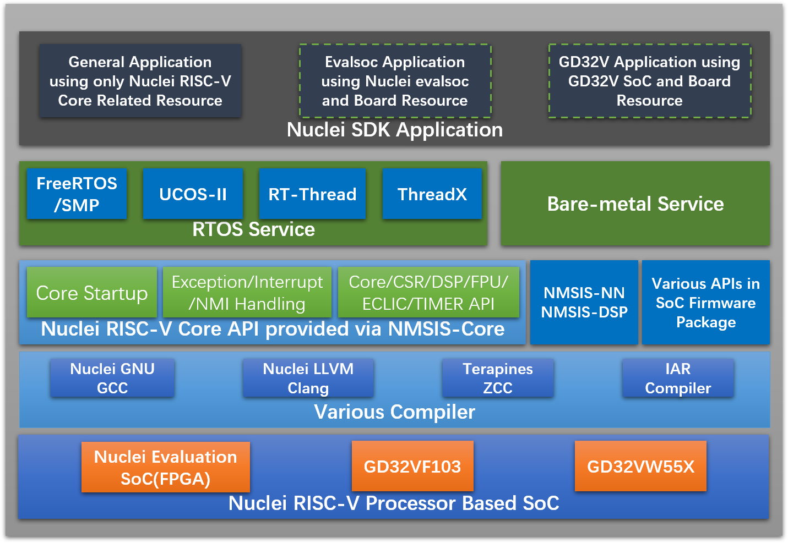

# Nuclei Software Development Kit

> [!NOTE]
> If you want to build and run on Nuclei 100 series CPU, please switch to **develop_n100** or **master_n100** branch.

> Since 0.5.0 release, Nuclei Studio >= 2023.10 and Nuclei RISC-V Toolchain/Qemu/OpenOCD >= 2023.10 are required to build and run.

**Nuclei Software Development Kit(Nuclei SDK)** is developed for developing and evaluating software for Nuclei Evaluation SoC.

This Nuclei SDK is built based on the **NMSIS** framework, user can access all the APIs provided by **NMSIS** and also the APIs that provided by Nuclei SDK which mainly for on-board peripherals access such as GPIO, UART, SPI and I2C etc.

This Nuclei SDK can support various compiler such as Nuclei riscv gcc/clang, IAR compiler and Terapines ZCC.

We also integrated many RTOSes into Nuclei SDK, which are **FreeRTOS**, **UCOSII**, **RTThread** and **ThreadX**, you can easily find it in the *OS* folder.

## Quick Startup

Wanner to take a try with **Nuclei SDK for Nuclei 200/300/600/900/1000 series CPU**, click [Quick Start with Nuclei SDK](https://doc.nucleisys.com/nuclei_sdk/quickstart.html) to start up.

Wanner to take a try with **Nuclei N100 SDK for Nuclei 100 series CPU**, click [Quick Start with Nuclei N100 SDK](https://doc.nucleisys.com/nuclei_n100_sdk/quickstart.html) to start up.

## Requirements

* Ubuntu Linux >=20.04 LTS or Windows >=7
  - **Linux**: GNU Make >= 3.82
  - **Windows**: [Windows Build Tools](https://nucleisys.com/download.php)
* [Nuclei Studio >= 2024.06](https://nucleisys.com/download.php)
  - Nuclei Studio can support import Nuclei SDK NPK package to provide IDE project wizard create/build/debug.
  - Nuclei Studio also contains same release of Nuclei Toolchain/QEMU/OpenOCD, so just download IDE is enough.

## Directory Structure

Here is the directory structure for this Nuclei SDK.

~~~console
$NUCLEI_SDK_ROOT
├── application
│   ├── baremetal
│   ├── freertos
│   ├── ucosii
│   ├── threadx
│   └── rtthread
├── Build
│   ├── gmsl
│   ├── toolchain
│   ├── Makefile.base
│   ├── Makefile.conf
│   ├── Makefile.core
│   ├── Makefile.components
│   ├── Makefile.files
│   ├── Makefile.global
│   ├── Makefile.misc
│   ├── Makefile.rtos
│   ├── Makefile.rules
│   └── Makefile.soc
├── doc
│   ├── build
│   ├── source
│   ├── Makefile
│   └── requirements.txt
├── NMSIS
│   ├── Core
│   ├── DSP
│   ├── NN
│   └── Library
├── OS
│   ├── FreeRTOS
│   ├── UCOSII
│   ├── ThreadX
│   └── RTThread
├── SoC
│   ├── gd32vf103
│   └── evalsoc
├── test
│   ├── core
│   ├── ctest.h
│   ├── LICENSE
│   └── README.md
├── LICENSE
├── Makefile
├── NMSIS_VERSION
├── package.json
├── SConscript
├── README.md
├── setup.bat
└── setup.sh
~~~

* **application**

  This directory contains all the application softwares for this Nuclei SDK.

  The application code can be divided into mainly 4 parts, which are:
  - **Baremetal** applications, which will provide baremetal applications without any OS usage, these applications will be placed in *application/baremetal/* folder.
  - **FreeRTOS** applications, which will provide FreeRTOS applications using FreeRTOS RTOS, placed in *application/freertos/* folder.
  - **UCOSII** applications, which will provide UCOSII applications using UCOSII RTOS, placed in *application/ucosii/* folder.
  - **RTThread** applications, which will provide RT-Thread applications using RT-Thread RTOS, placed in *application/rtthread/* folder.
  - **ThreadX** applications, which will provide ThreadX applications using ThreadX RTOS, placed in *application/threadx/* folder.

* **SoC**

  This directory contains all the supported SoCs for this Nuclei SDK, the directory name for SoC and its boards should always in lower case.

  Here we mainly support Nuclei processor cores running on Nuclei FPGA evaluation boards, the support package placed in *SoC/evalsoc/*.

  In each SoC's include directory, *nuclei_sdk_soc.h* must be provided, and include the soc header file, for example, *SoC/evalsoc/Common/Include/nuclei_sdk_soc.h*.

  In each SoC Board's include directory, *nuclei_sdk_hal.h* must be provided, and include the board header file, for example, *SoC/evalsoc/Board/nuclei_fpga_eval/Include/nuclei_sdk_hal.h*.

* **Build**

  This directory contains the key part of the build system based on Makefile for Nuclei SDK.

* **NMSIS**

  This directory contains the NMSIS header files, which is widely used in this Nuclei SDK,
  you can check the *[NMSIS_VERSION](NMSIS_VERSION)* file to know the current *NMSIS* version used in **Nuclei-SDK**.

  We will also sync the changes in [NMSIS project](https://github.com/Nuclei-Software/NMSIS) when it provided a new release.

* **OS**

  This directory provided RTOS packages we suppported.

* **LICENSE**

  Nuclei SDK license file.

* **NMSIS_VERSION**

  NMSIS Version file. It will show current NMSIS version used in Nuclei SDK.

* **package.json**

  PlatformIO package json file for Nuclei SDK, used in [Nuclei Platform for PlatformIO](https://platformio.org/platforms/nuclei/)

* **SConscript**

  RT-Thread package scons build script, used in [RT-Thread package development](https://www.rt-thread.org/document/site/development-guide/package/package/).

* **Makefile**

  An external Makefile just for build, run, debug application without cd to any corresponding application directory, such as *application/baremetal/helloworld/*.

* **setup.sh**

  Nuclei SDK environment setup script for **Linux**. You need to create your own `setup_config.sh`.

  ~~~shell
  # This can be path to Nuclei Studio's toolchain folder
  NUCLEI_TOOL_ROOT=/path/to/your_tool_root
  ~~~

  In the **$NUCLEI_TOOL_ROOT** for **Linux**, you need to have Nuclei RISC-V toolchain and OpenOCD installed as below.

  ~~~
  ${NUCLEI_TOOL_ROOT}
  ├── gcc
  │   ├── bin
  │   ├── include
  │   ├── lib
  │   ├── libexec
  │   ├── riscv64-unknown-elf
  │   └── share
  └── openocd
      ├── bin
      ├── contrib
      ├── distro-info
      ├── OpenULINK
      ├── scripts
      └── share
  ~~~

* **setup.bat**

  Nuclei SDK environment setup bat script for **Windows**. You need to create your own `setup_config.bat`.

  ~~~bat
  set NUCLEI_TOOL_ROOT=\path\to\your_tool_root
  ~~~

  In the **%NUCLEI_TOOL_ROOT%** for **Windows**, you need to have Nuclei RISC-V toolchain, necessary Windows build tools and OpenOCD installed as below.

  ~~~console
  %NUCLEI_TOOL_ROOT%
  ├── build-tools
  │   ├── bin
  │   ├── gnu-mcu-eclipse
  │   └── licenses
  ├── gcc
  │   ├── bin
  │   ├── include
  │   ├── lib
  │   ├── libexec
  │   ├── riscv64-unknown-elf
  │   └── share
  └── openocd
      ├── bin
      ├── contrib
      ├── distro-info
      ├── OpenULINK
      ├── scripts
      └── share
  ~~~

## How to use

1. Create and modify your own setup config
   * For **Linux**, create `setup_config.sh` in **$NUCLEI_SDK_ROOT**.
   * For **Windows**, create `setup_config.bat` in **%NUCLEI_SDK_ROOT%**.
2. Source the environment script right in **NUCLEI_SDK_ROOT**
   * For **Linux**: `source setup.sh`
   * For **Windows**: `setup.bat`
3. Build and run application.
   * **Note:** By default, the SoC and Board is set to ``evalsoc`` and ``nuclei_fpga_eval``,
     if you don't pass any **SOC** and **BOARD** variable in Make command,
     it will use the default SoC and Board.
   * Assume that you will run this application -> *application/baremetal/helloworld/*.
   * cd *application/baremetal/helloworld/*
   * you can run *make help* to show help message.
   * We provided different Nuclei Core configurations(CORE=<your_core>) we supported, see *Build/Makefile.core*.
     - such as `CORE=n300`
   * We support several download modes(DOWNLOAD=<mode>) for different applications.
     - **flashxip**: Program will to be downloaded into flash and run directly in Flash
     - **flash**: Program will be downloaded into flash, when running, program will be copied to ilm/ram and run in ilm/ram
     - **ilm**: Program will be downloaded into ilm/ram and run directly in ilm/ram, program lost when poweroff
   * For example, if you want to build your application for *CORE=n300 DOWNLOAD=ilm*, you can easily run this command:
     ~~~shell
     make CORE=n300 DOWNLOAD=ilm all
     ~~~
   * If you want to upload your application for *CORE=n300 DOWNLOAD=ilm*, you can easily run this command:
     ~~~shell
     make CORE=n300 DOWNLOAD=ilm upload
     ~~~
   * (Option 1)If you want to debug your application for *CORE=n300 DOWNLOAD=ilm*:
     - First open a new terminal in the same application folder and run: `make CORE=n300 DOWNLOAD=ilm run_openocd`
     - Then run this command `make CORE=n300 DOWNLOAD=ilm run_gdb` in the existing terminal, then you can debug it using gdb,
       if you want to load your program, you need to type `load` to achieve it.
     - **Notice**: Since version 0.2.4, you can also pass extra `GDB_PORT=<portno>`, to change to use new gdb port other than default
       `3333`, for example, `make CORE=n300 DOWNLOAD=ilm GDB_PORT=3344 run_openocd` and `make CORE=n300 DOWNLOAD=ilm GDB_PORT=3344 run_gdb`
   * (Option 2)If you want to debug your application for *CORE=n300 DOWNLOAD=ilm*:
     ~~~shell
     make CORE=n300 DOWNLOAD=ilm debug
     ~~~
   * If you want to use UART terminal tool to view the UART message, you can choose `screen` or `minicom` in Linux, `teraterm` in Windows, the default UART baudrate we use is `115200`.

## Knowledge book

* Since 0.5.0 release, Nuclei SDK only support Nuclei RISC-V Toolchain >= 2023.10, and toolchain prefix
changed from `riscv-nuclei-elf-` to `riscv64-unknown-elf-`.

* If you want to learn more about **Nuclei SDK documentation**, please click [Nuclei SDK documentation](http://doc.nucleisys.com/nuclei_sdk)

* If you need to build a new application, or change **CORE** or **DOWNLOAD** option, please make sure that you have clean the project by `make clean`

* If you want to specify additional compiler flags, please follow this guidance in your application Makefile.
  - Pass common compiler flags to all c/asm/cpp compiler, you can use **COMMON_FLAGS** in Makefile, such as `COMMON_FLAGS := -O3 -funroll-loops -fpeel-loops`
  - Pass C compiler only flags to c compiler, you can use **CFLAGS** in Makefile, such as `CFLAGS := -O3 -funroll-loops -fpeel-loops`
  - For ASM compiler only flags, you can use **ASMFLAGS**, for CPP compiler only flags, you can use **CXXFLAGS**.

* If you want to pass additional linker flags, you can use **LDFLAGS**, and if you have additional library directories, you can use **LIBDIRS** to specify library directories.

* The preprovided applications and its makefile is the best startup examples about how to use Nuclei SDK.

* Pass extra `V=1` to your make command, it will show verbose compiling information, otherwise it will only show basic information. Sample output with extra `V=1`
  ~~~console
  $ make V=1 all
  Current Configuration: TOOLCHAIN=nuclei_gnu RISCV_ARCH=rv32imafdc RISCV_ABI=ilp32d RISCV_TUNE=nuclei-300-series RISCV_CMODEL=medlow SOC=evalsoc BOARD=nuclei_fpga_eval CORE=n300fd ARCH_EXT= DOWNLOAD=ilm STDCLIB=newlib_nano SMP= BOOT_HARTID=0
  Assembling :  ../../../SoC/evalsoc/Common/Source/GCC/intexc_evalsoc.S
  riscv64-unknown-elf-gcc -x assembler-with-cpp -O2 -DBOOT_HARTID=0 -march=rv32imafdc -mabi=ilp32d -mcmodel=medlow -mtune=nuclei-300-series -g -fno-common  -ffunction-sections -fdata-sections -DDOWNLOAD_MODE=DOWNLOAD_MODE_ILM -DDOWNLOAD_MODE_STRING=\"ILM\" -DCPU_SERIES=300  -I. -I../../../NMSIS/Core/Include -I../../../SoC/evalsoc/Board/nuclei_fpga_eval/Include -I../../../SoC/evalsoc/Common/Include -Iinc -MMD -MT ../../../SoC/evalsoc/Common/Source/GCC/intexc_evalsoc.S.o -MF
  ../../../SoC/evalsoc/Common/Source/GCC/intexc_evalsoc.S.o.d -c -o ../../../SoC/evalsoc/Common/Source/GCC/intexc_evalsoc.S.o ../../../SoC/evalsoc/Common/Source/GCC/intexc_evalsoc.S
  Assembling :  ../../../SoC/evalsoc/Common/Source/GCC/intexc_evalsoc_s.S
  riscv64-unknown-elf-gcc -x assembler-with-cpp -O2 -DBOOT_HARTID=0 -march=rv32imafdc -mabi=ilp32d -mcmodel=medlow -mtune=nuclei-300-series -g -fno-common  -ffunction-sections -fdata-sections -DDOWNLOAD_MODE=DOWNLOAD_MODE_ILM -DDOWNLOAD_MODE_STRING=\"ILM\" -DCPU_SERIES=300  -I. -I../../../NMSIS/Core/Include -I../../../SoC/evalsoc/Board/nuclei_fpga_eval/Include -I../../../SoC/evalsoc/Common/Include -Iinc -MMD -MT ../../../SoC/evalsoc/Common/Source/GCC/intexc_evalsoc_s.S.o -MF
  ../../../SoC/evalsoc/Common/Source/GCC/intexc_evalsoc_s.S.o.d -c -o ../../../SoC/evalsoc/Common/Source/GCC/intexc_evalsoc_s.S.o ../../../SoC/evalsoc/Common/Source/GCC/intexc_evalsoc_s.S
  Assembling :  ../../../SoC/evalsoc/Common/Source/GCC/startup_evalsoc.S
  ~~~

## [Contributing](https://doc.nucleisys.com/nuclei_sdk/contribute.html)

## [Changelog](https://doc.nucleisys.com/nuclei_sdk/changelog.html)
