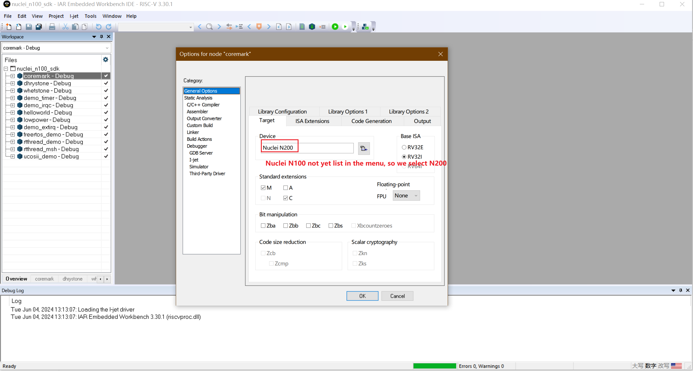

# IAR Embedded Workbench IDE Projects For Nuclei Processors

In this folder, we provided a prebuilt IAR workspace with baremetal and rtos projects.

> You can refer to this demo projects to build your own iar projects.

These projects demostrated the following features:

- Provide support for Nuclei Evaluation SoC which is a prototype and evaluation SoC mainly
  used to evaluate Nuclei RISC-V processor such as 200/300/600/900 series.
- RISC-V Extension IMAFDCB are supported in this project.
- These projects are based on Nuclei SDK project which intergated NMSIS standard.
- We have implemented CPU core startup, exception handling and linker script and ported NMSIS Core
  for IAR Compiler, please check the commit histories for the changes we have made.
- These projects are using iar linker script icf file provided in this project not the one in IAR workbench.
- Currently both Nuclei RV32 and RV64 processors are supported in this project.
- RISC-V DSP feature is still working in progress together with IAR team.
- DSP/NN libraries are able to be used in this project, you can try with prebuilt libraries, but not able to
  use any dsp intrinsic API, since not yet full compatiable with IAR version.
- For linker file used in IAR, the stack and heap are just following data/bss section, not at the end of ram,
  so you need to take care of the stack and heap size setting in IAR workbench, which means if your application
  code use a lot of heap or stack, the application may crash, you need to increase stack or heap size on demand.

You can directly try with this iar workspace by click this nucleisdk.eww after you have installed [IAR Workbench](https://www.iar.com/riscv).

If you want to debug using I-jet, you need to change Debugger Driver to I-jet in iar project options.

For Nuclei FPGA Evaluation Board, you need to connect I-jet JTAG pins to our FPGA onboard JTAG pins.

- VTref       <->   3.3V
- SWDIO/TMS   <->   TMS
- SWCLK/TCK   <->   TCK
- SWO/TDO     <->   TDO
- TDI         <->   TDI
- GND         <->   GND

If you want to see UART output, you need to connect FPGA UART TX/RX to your usb uart debug cable.

You can also try with C-SPY emulated IO by define `DEBUG_IAR_BREAKPOINT` in `SoC/evalsoc/Common/Source/Stubs/iardlib/stubs.c` to get print output.

For more details about how to use IAR workbench, please refer to its user guides.
